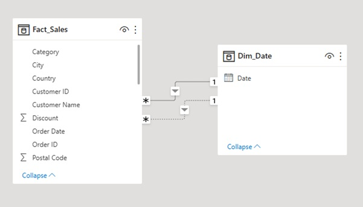
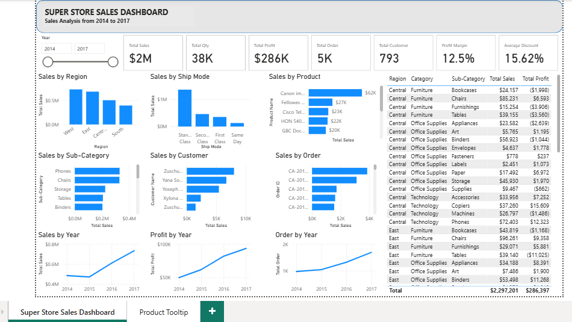

# Executive Sales Analytics Dashboard

## Project Overview

This project demonstrates the design and development of an Executive Sales Analytics Dashboard using Power BI. The solution enables business users to monitor sales performance, profitability, customer segments, and product performance through interactive dashboards built using Power Query, star schema modeling, and reusable DAX measures.

## Business Problem

The organization required an executive dashboard to monitor sales performance, profitability, customer segments, and product categories through interactive reporting.

## Business Objectives

- Create a centralized sales reporting solution.

- Enable executives to monitor sales and profitability.

- Analyze sales across regions, products, and customer segments.

- Replace static reports with interactive dashboards.

## Dataset Overview

The dataset contains transactional sales records, customer information, product hierarchy, geographical details, shipping information, and order dates used for business performance analysis.

The model follows a simple star schema with the Sales fact table connected to a dedicated Date dimension. The active relationship uses Order Date for reporting, while Ship Date is maintained as an inactive relationship for future time-based analysis using DAX.

## Dashboard Overview

Super Store Sales Dashboard-

Developed a Power BI dashboard using a star schema data model with DAX measures and interactive visualizations.

The dashboard provides:

- Executive KPI summary

- Sales by Region

- Sales by Ship Mode

- Category and Sub-category performance

- Customer analysis

- Year-over-year sales trends

## KPIs

- Total Sales

- Total Profit

- Total Orders

- Total Customers

- Sales Quantity

- Profit Margin %

- Average Discount

## Technologies Used

- Microsoft Power BI Desktop

- Power Query

- DAX

- Microsoft Excel

- Star Schema Modeling

## Skills Demonstrated

- Power Query

- Star Schema Modeling

- DAX

- Dashboard Design

- KPI Development

## Business Value

The dashboard enables business users to:

- Monitor overall sales performance.

- Compare regional performance.

- Analyze customer and product profitability.

- Identify sales trends.

- Support faster business decision-making.

## Challenges and Solutions

| Challenge | Solution|
|------------|:------:|
| Multiple date fields | Created a Date dimension with active/inactive relationships | 
| Sales analysis | Developed reusable DAX measures | 

## My Role

I independently completed the following activities:

- Business requirement analysis

- Data profiling

- Power Query transformations

- Star schema design

- DAX development

- Dashboard design

- KPI validation

- Documentation

## Lessons Learned

This project introduced the fundamentals of Power BI development, including data preparation, star schema modeling, DAX measures, and dashboard design.

Key learnings include:

- Building a basic star schema.

- Creating reusable DAX measures.

- Designing executive dashboards focused on business questions.

- Understanding the importance of a dedicated Date dimension for reporting.

## Limitations

The following limitations were identified as part of the project scope:

- The dataset is based on a simulated retail sales dataset and does not represent live business transactions.

- The solution uses Import Mode and does not include scheduled data refresh.

- Role-Based Security (RLS) has not been implemented.

- The dashboard focuses on executive reporting and does not include detailed drill-through analysis.

- Integration with enterprise systems such as ERP, CRM, or SQL databases is outside the scope of this project.

## Future Enhancements

- Scheduled Refresh

- Row Level Security

- Drill through

Power BI Service Deployment
